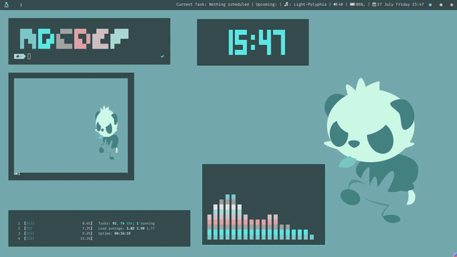

# material_green_i3
## Preview:

## Things to remember:
* The status bar is *tint2* and it uses the given *tint2rc*.
* The scripts *multistat*, *toDo*, *clearToDo* and *modToDo* must be stored in /bin/
* The script *music.sh* must be stored in the HOME directory.
