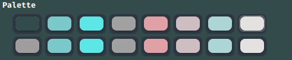

# material_green_i3
## Preview:

## Things to remember:
* The status bar is *tint2* and it uses the given *tint2rc*.
* The scripts *multistat*, *toDo*, *clearToDo* and *modToDo* must be stored in /bin/
* The script *music.sh* must be stored in the HOME directory.
* To play music, your songs must be stored in *~/Music/All*
* The rofi theme *rofi.rasi* must be saved in /usr/share/rofi/themes/ and can be activated using rofi-theme-selector.
* You can use the *Material_Green_Dark_GTK3.zip* as your gtk theme, however, it is still a work in progress.

## The bar:

* The tint2 bar is running the *multistat* script for status.
* Clicking on the red dot will log you out of i3 (killall i3).
* Left clicking the yellow dot runs the music script (launches music.sh which uses rofi).
* Right clicking the yellow dot stops the music.
* Left clicking the green dot lets you add tasks via rofi.
* Right clicking the green dot lets you delete tasks via rofi.

## The colorscheme:

* Currently the colorscheme is only available for the xfce4-terminal via the *terminalrc*.
* You can copy the *terminalrc* to ~/.config/xfce4/terminal/terminalrc
* Black: #344B4C
* Grey: #9F9D9D
* Red/Light red: #7AC8CA (it doesn't actually use red :p )
* Green/Light green: #5CE6E6
* Brown/Yellow: #A2A1A2 (doesn't use brown/yellow either)
* Blue/Light blue: #DFA1A5
* Magenta/Light Magenta: #CFBEC1
* Cyan/Light cyan: #ACD5D6
* White/Light grey: #E4E1E1

## Programs required:
* Rofi
* tint2
* sox (for music)
* xfce4-terminal (optional, but can be used with the terminalrc for the colorscheme)
